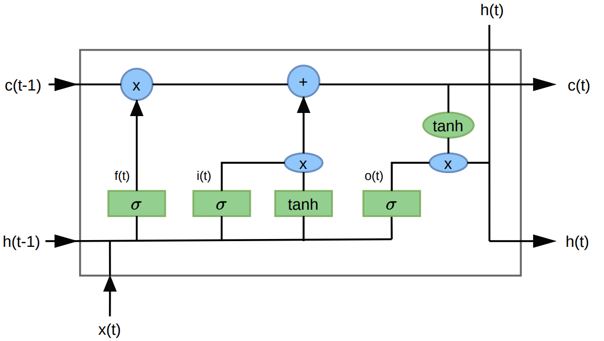
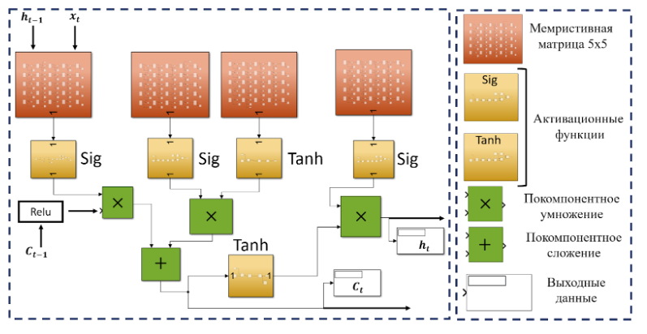

# Memristive-LSTM

В этом репозитории находится модельная реализация сети LSTM, с использованием мемристивных устройств. Представлен код обучения нейронной сети на примере записи из открытой базы данных ЭЭГ детской Бостонской больницы https://physionet.org/content/chbmit/1.0.0/ 
А также реализация в программе SimuLink.

Рисунок 1. Схема LSTM ячейки

Опишем работу ячейки LSTM. Она имеет два скрытых состояния: одно из них представляет собой краткосрочную память $h_t$, а другое — долгосрочную память $c_t$. Три фильтра регулируют поток информации в ячейку и из нее. Ячейка также содержит блоки сигмоид $σ$ и блоки гиперболических тангенсов ($tgh$). 
Идея долгосрочной памяти заключается в том, чтобы по совокупности информации от краткосрочной памяти на предыдущем шаге $h_{t–1}$ и от входа $x_t$ понять, какую информацию мы хотим далее хранить, а какую нет. 
Сначала рассмотрим информацию, которую мы хотим забыть (не хранить дальше). За это отвечает фильтр забывания $f_t$, уравнение для которого выглядит следующим образом: 
$f_t=σ(W_{xf}x_t+W_{hf}h_{t–1})$,                     
где $σ$ — сигмоидная функция активации; $W_{xf}$, $W_{hf}$ — обучаемые матрицы весов.
Индексы здесь и далее обозначают следующее. Первый из индексов указывает на принадлежность к краткосрочной памяти $h$ или входу $x$. Второй индекс отвечает за принадлежность к тому или иному фильтру. Таким образом, $W_{xf}$ — обучаемая матрица весов, соответствующая входу $x$ и фильтру забывания $f_t$. 
Если в результате покомпонентного умножения (×) на состояние долго­срочной памяти $c_{t-1}$ мы получаем 0, то данная информация будет забыта, если 1 — сохранена. 
Для информации, которую мы хотим запомнить, используется входной фильтр с сигмоидой $σ$, чтобы понять, в какие компоненты состояния долгосрочной памяти $c_t$ мы хотим вставить информацию:
$i_t=σ(W_{xi}x_t+W_{hi}h_{t-1}).$                         
Фильтр $g_t$ с гиперболическим тангенсом ($tgh$) используется для того, чтобы понять, какую информацию хотим сохранить:
$g_t=tgh(W_{xg}x_t+W_{hg}h_{t–1})$.                 
Иными словами, в схеме на рис. 1 умножение означает выбор информации, а сложение — добавление информации. Тогда итоговая формула для изменения долгосрочной памяти $c_t$ будет выглядеть следующим образом:
$c_t=f_tc_{t–1}+i_tg_t$.                             
Для получения выхода $h_t$ используется фильтр выхода $o_t$ и информация из долгосрочной памяти $c_t$:
$h_t=o_t×tgh(c_t)$                            
где $o_t= σ(W_{xo}x_t+W_{ho}h_t)$.

Весовые матрицы $W$ в сети обучались методом обратного распространения ошибки с MSE функцией потерь.

Разработанная сеть представляет собой достаточно простую архитектуру долгой краткосрочной памяти. Модель включает в себя первый линейный входной слой размером 23×5 ($W_{in}$) с функцией активации Relu. После этого размещается ячейка долгой краткосрочной памяти, с 5 нейронами в скрытом состоянии. Выходом ячейки является последнее скрытое состояние. Результат этих операций проецируется последним линейным выходным слоем с весовой матрицей размером 5×23($W_{out}$). Этот последний выходной слой позволяет нам получить прогнозируемое значение. Описанная архитектура схематически представлена на рисунке 1. Размер матрицы для ячейки долгой краткосрочной памяти в этом случае [5x 5].
Для реализации одного вычислительного блока требуется кроссбар-матрица размера [5 x 5]. Всего для реализации описанной ячейки долгой краткосрочной памяти необходимо 4 блока, т.е. 4 мемристивных кроссбар-матрицы указанного размера.

Рисунок 2. Архитектура мемристивной LSTM ячейки

Эта модель учитывает один набор весов в нейронной сети LSTM для одной ячейки.
Чтобы создать несколько наборов весов для различных целей, вы можете подключить выходы (out 2, out 3 и т.д.) к определенным парам мемристоров и соответствующим образом настроить их параметры. Изменяя задержку синхронизации, вы можете достичь желаемых результатов. Чтобы получить несколько выходных значений, увеличьте количество выходных значков.

Параметры функции активации были тщательно подобраны и не требуют дополнительной настройки.

Разница между предсказаниями сетью в программной реализации  на python и в модельной с помощью мемристивной архитектуры в среднем составляет 0.46% и не превосходит 7 %.

Ниже представлены веса данной обученной нейронной сети, округленные до двух знаков после запятой.

Матрица весов $W_{in}$:

|       |       |       |       |       |
|-------|-------|-------|-------|-------|
| 0.25  | -0.47 | 0.33  | -0.03 | -0.05 |
| 0.39  | -0.37 | 0.21  | 0.07  | 0.05  |
| 0.17  | -0.32 | 0.17  | 0.10  | -0.08 |
| -0.02 | -0.27 | 0.41  | -0.02 | -0.06 |
| 0.36  | -0.34 | 0.26  | 0.02  | -0.02 |
| -0.06 | -0.46 | 0.15  | 0.13  | 0.02  |
| 0.24  | -0.33 | 0.24  | -0.04 | -0.05 |
| -0.03 | 0.03  | 0.57  | 0.03  | -0.07 |
| 0.08  | 0.04  | 0.06  | 0.04  | -0.02 |
| -0.22 | -0.12 | 0.38  | 0.13  | -0.02 |
| 0.21  | -0.08 | -0.51 | -0.04 | -0.09 |
| 0.36  | 0.08  | -0.84 | 0.02  | -0.02 |
| 0.18  | -0.02 | -0.35 | 0.08  | 0.04  |
| 0.11  | 0.19  | -0.16 | -0.08 | -0.05 |
| 0.16  | 0.26  | -0.72 | 0.06  | -0.09 |
| 0.01  | 0.38  | -0.32 | 0.10  | -0.03 |
| -0.24 | 0.20  | -0.45 | 0.10  | -0.00 |
| -0.05 | 0.26  | -0.34 | 0.08  | -0.09 |
| -0.11 | 0.42  | -0.49 | -0.04 | -0.01 |
| -0.39 | 0.29  | 0.12  | 0.02  | 0.01  |
| -0.40 | 0.44  | 0.17  | 0.02  | -0.03 |
| -0.68 | -0.06 | 1.03  | -0.05 | -0.04 |
| -0.74 | 0.19  | 0.88  | 0.14  | -0.03 |

Транспонированная матрица весов $W_{out}$:

|       |      |       |      |       |
|-------|------|-------|------|-------|
| 3.88  | 2.65 | 0.02  | 4.63 | -2.67 |
| 3.64  | 2.66 | 0.02  | 5.05 | -2.55 |
| 3.52  | 2.82 | 0.07  | 4.96 | -2.56 |
| 3.28  | 3.15 | 0.17  | 4.63 | -2.53 |
| 2.90  | 3.41 | 0.23  | 4.58 | -2.34 |
| 2.44  | 3.57 | 0.25  | 4.70 | -2.06 |
| 2.05  | 3.80 | 0.15  | 4.68 | -1.57 |
| 1.79  | 4.06 | 0.04  | 4.49 | -1.12 |
| 1.52  | 4.03 | -0.11 | 4.71 | -0.60 |
| 1.30  | 4.11 | -0.19 | 4.62 | -0.26 |
| 0.93  | 4.18 | -0.38 | 4.57 | 0.37  |
| 0.75  | 4.31 | -0.47 | 4.40 | 0.73  |
| 0.56  | 4.31 | -0.55 | 4.50 | 1.02  |
| 0.31  | 4.16 | -0.69 | 4.77 | 1.43  |
| -0.04 | 3.94 | -0.84 | 5.06 | 1.91  |
| -0.48 | 3.89 | -0.83 | 5.10 | 2.18  |
| -0.98 | 3.65 | -0.78 | 5.34 | 2.41  |
| -1.68 | 3.44 | -0.52 | 5.42 | 2.38  |
| -2.37 | 3.49 | -0.14 | 5.04 | 2.17  |
| -2.77 | 3.75 | 0.44  | 4.19 | 1.41  |
| -2.82 | 3.65 | 1.13  | 3.42 | 0.16  |
| -2.57 | 3.57 | 1.59  | 2.59 | -0.88 |
| -2.66 | 3.61 | 1.82  | 1.66 | -1.18 |

Матрица весов $W_{xf}$:

|      |      |         |       |        |
|------|------|---------|-------|--------|
| 0,11 | 0,07 | 0,08    | -0,09 | 0,13   |
| 0,06 | 0,05 | 0,10    | 0,06  | 0,00   |
| 0,45 | 0,70 | -133,79 | 0,20  | -0,36  |
| 0,04 | 0,05 | 0,06    | -0,03 | 0,15   |
| 0,20 | 0,15 | -1,79   | 0,00  | -0,05  |

Матрица весов $W_{xi}$:

|       |        |       |       |        |
|-------|--------|-------|-------|--------|
| 0,88  | 0,41   | 28,10 | -0,52 | 0,27   |
| 0,07  | -0,05  | -0,01 | 0,41  | -0,12  |
| 0,00  | 104,57 | 0,08  | -0,33 | 0,42   |
| 38,04 | 36,64  | 32,73 | 31,03 | 36,06  |
| 42,93 | -0,43  | 53,07 | -0,60 | 0,65   |

Матрица весов $W_{xo}$:

|       |       |       |       |        |
|-------|-------|-------|-------|--------|
| 2,24  | 1,31  | 1,70  | 1,28  | 0,06   |
| 2,07  | 4,15  | 2,87  | 18,56 | 6,25   |
| 71,72 | 0,13  | 0,62  | 0,20  | -0,28  |
| 5,67  | 8,38  | 15,79 | 29,37 | 20,32  |
| 57,32 | -0,17 | 0,31  | 0,35  | -0,45  |

Матрица весов $W_{xg}$:

|       |       |       |       |        |
|-------|-------|-------|-------|--------|
| 0,16  | -0,20 | -0,05 | -0,08 | 0,06   |
| -0,02 | 0,03  | 0,01  | 0,08  | -0,09  |
| -0,05 | -0,13 | 0,21  | -0,04 | 0,01   |
| -0,01 | 0,01  | 0,00  | 0,68  | -0,79  |
| 0,00  | 0,01  | -0,12 | -0,04 | 0,04   |

Матрица весов $W_{hf}$:

|       |       |       |       |        |
|-------|-------|-------|-------|--------|
| -0,50 | 0,19  | 3,23  | 0,87  | 2,12   |
| 0,16  | -0,85 | 0,14  | 0,58  | 0,51   |
| 2,71  | -0,85 | 2,59  | -0,43 | 2,99   |
| 0,25  | -0,32 | 0,13  | 0,95  | -0,08  |
| -1,64 | -1,96 | -7,67 | 2,54  | 2,86   |

Матрица весов $W_{hi}$:

|        |       |        |       |         |
|--------|-------|--------|-------|---------|
| 0,88   | 1,70  | 1,50   | -0,51 | -12,06  |
| -0,74  | -0,09 | 0,01   | -1,62 | -0,34   |
| -10,28 | 2,29  | 0,77   | 0,49  | 6,20    |
| 2,40   | -8,67 | -25,65 | -2,47 | -5,71   |
| -1,29  | 2,75  | 1,32   | 1,21  | 3,92    |

Матрица весов $W_{ho}$:

|       |       |        |        |         |
|-------|-------|--------|--------|---------|
| 5,89  | -4,01 | -1,48  | -0,63  | -25,47  |
| 4,66  | -3,27 | -1,82  | -4,87  | -10,29  |
| 2,12  | -0,80 | -1,54  | -1,05  | 4,21    |
| -6,04 | -0,47 | -11,62 | -14,31 | -5,64   |
| -3,67 | -1,36 | -5,49  | -0,77  | -0,33   |

Матрица весов $W_{hg}$:

|       |       |       |       |        |
|-------|-------|-------|-------|--------|
| -1,07 | 0,39  | -0,17 | 0,15  | -0,50  |
| 0,27  | -0,06 | 0,00  | 0,81  | 0,02   |
| -0,93 | -0,01 | 0,30  | 0,37  | 1,70   |
| -0,26 | -2,30 | 0,02  | -1,87 | 0,06   |
| 0,34  | 0,10  | -0,15 | 0,08  | -0,68  |

